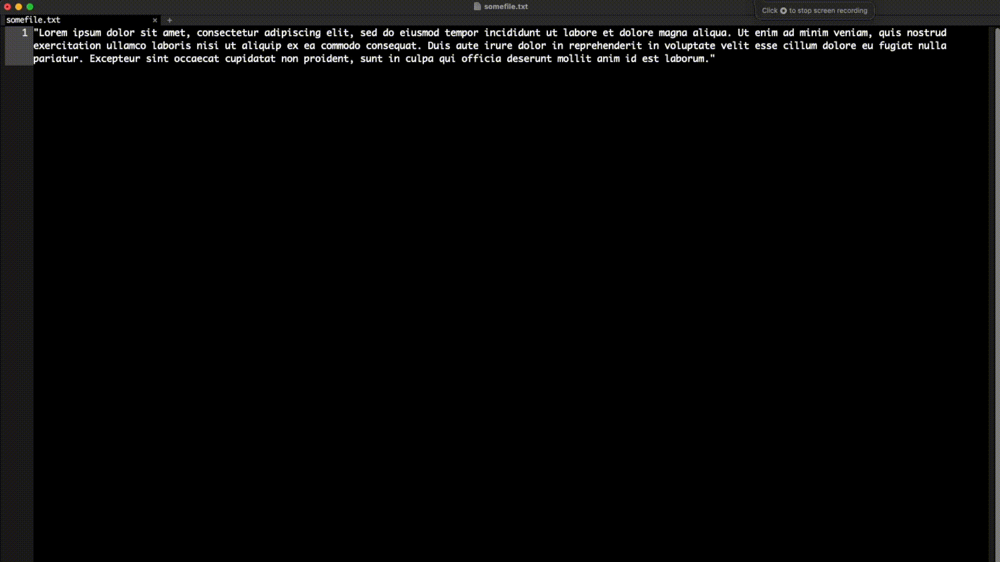

# rainbow-highlight
This is a lisp script for emacs that enabels you to make awesome highlight of any snippet of text.

Just copy the script from the `rainbow-highlight.el` to your emacs init-file (or any other nerdery of your choice to get the letters in there, may it be require or inclusion or what not of an external file).

... then just highlight any word or text and hit `C-c r` 💥🌈

