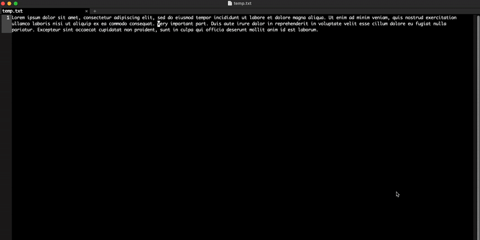

# rainbow-highlight
This is a Lisp script for Emacs that enables you to highlight any snippet of text in an awesome way.

Just copy the script from rainbow-highlight.el into your Emacs init file (or any other bit of nerdery of your choice—whether that’s require, include, or whatever way you prefer to load external files).

…then just highlight any word or text and hit C-c r 💥🌈

